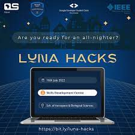

# Luna Hacks Projects 

> Luna Hacks 2.0 Hackathon projects

## Open Source
- [GitHub pages](https://grand-rick001.github.io/e-commerce-project/)
- [Contributed to an existing repo](https://github.com/Itsfoss0/90-days-of-web)
- [GitHub Workflows](https://github.com/grand-rick001/luna-hacks-projects/pull/2)

Github Skills

- [Introduction to github](https://github.com/Itsfoss0/introduction-to-github)
- [Communicate using markdown](https://github.com/Itsfoss0/communicate-using-markdown)
- [Github Pages course](https://github.com/Itsfoss0/hello-github-pages)
- [Fixing Merge conflicts](https://github.com/Itsfoss0/hello-merge-conflicts)
- [Release Based workflow](https://github.com/Itsfoss0/hello-merge-conflicts)
- [Connecting Dots course](https://github.com/Itsfoss0/lets-connect-the-dots)
-[Continous Integration](https://github.com/Itsfoss0/continous-integration)
- [Introduction to github actions](https://github.com/Itsfoss0/github-actions-luna)

## Software Development
- [Password Generator](https://github.com/grand-rick001/luna-hacks-projects/)
- [Random Quote Generator](https://github.com/grand-rick001/luna-hacks-projects/tree/master/software-engineering/random-quote-generator)
- [Create a silly Hack](https://github.com/grand-rick001/luna-hacks-projects/tree/master/software-engineering/space-api-web)
- [Use a space API](https://github.com/grand-rick001/luna-hacks-projects/tree/master/software-engineering/space-api-web)
- [Connect two APIs together](https://github.com/grand-rick001/luna-hacks-projects/tree/master/software-engineering/space-api-web)
- [Create a restful API](https://github.com/grand-rick001/luna-hacks-projects/tree/master/software-engineering/restful-api)
- [Guess the number](https://github.com/grand-rick001/luna-hacks-projects/tree/master/software-engineering/guess-the-number)
- [Scheduler](https://github.com/grand-rick001/luna-hacks-projects/tree/master/software-engineering/scheduler)
- [Sleep Tracker](https://github.com/grand-rick001/luna-hacks-projects/tree/master/software-engineering/sleep-tracker)
- [Sleeping app](https://github.com/grand-rick001/luna-hacks-projects/tree/master/software-engineering/sleepingapp)
- [Smart Pill Dispenser](https://github.com/grand-rick001/luna-hacks-projects/tree/master/software-engineering/smart-pill-dispenser)
- [Sorting Algorithms](https://github.com/grand-rick001/luna-hacks-projects/tree/master/software-engineering/sorting_algorithims)
- [URL Shortener](https://github.com/grand-rick001/luna-hacks-projects/tree/master/software-engineering/url-shortener)