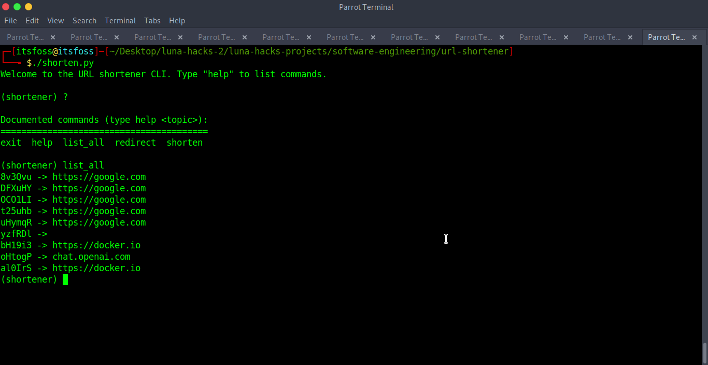

## CLI based URL shortener

This documentation describes a command-line based URL shortener tool, which can be used to shorten URLs using a CLI interface. This tool is designed to provide a simple and efficient way to shorten long URLs into shorter ones, which can be easily shared with others.

## Requirements:

This tool is written in Python 3 and requires the following packages to be installed on the system:

python3.6 or higher

selenium 

geckodriver  (for firefox)

## Usage
First you will need to clone this repository, 
in your terminal, run 
```
git clone https://github.com/grand-rick001/luna-hacks-projects
```

change the directory to the repo you just cloned

```
cd luna-hacks-projects/sofware-engineering/url-shortener

```
Install the required python modules

```
python -m pip install -r requirements.txt
```

Nice Nice.  You can now run python shortener.py and follow the prompts
